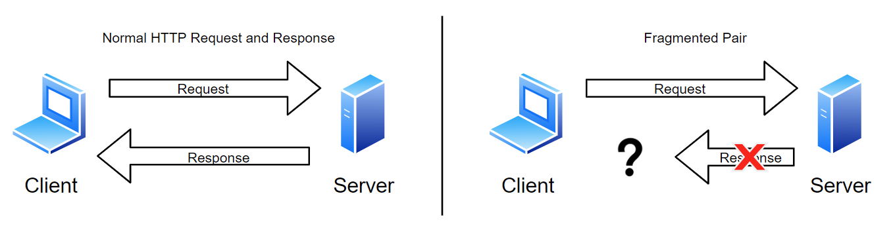
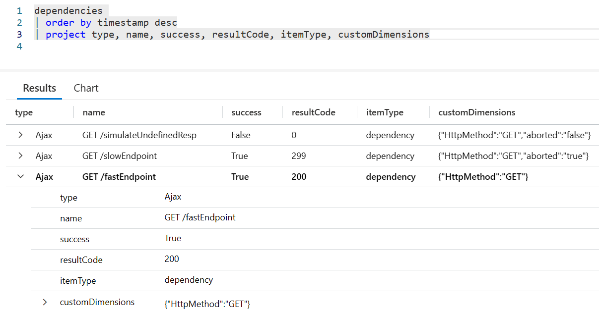
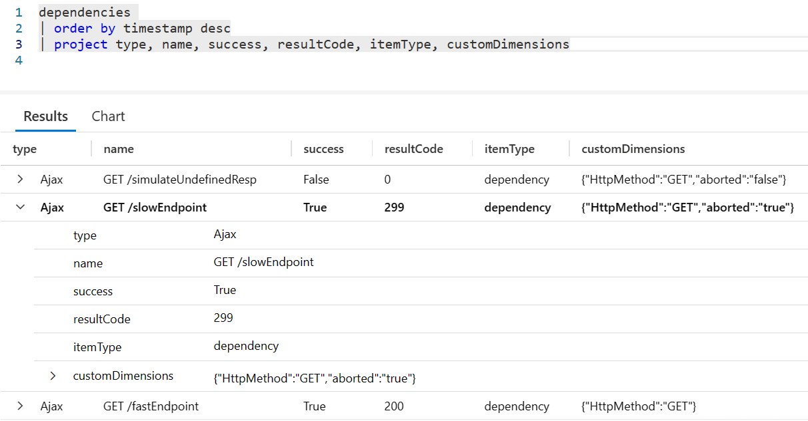
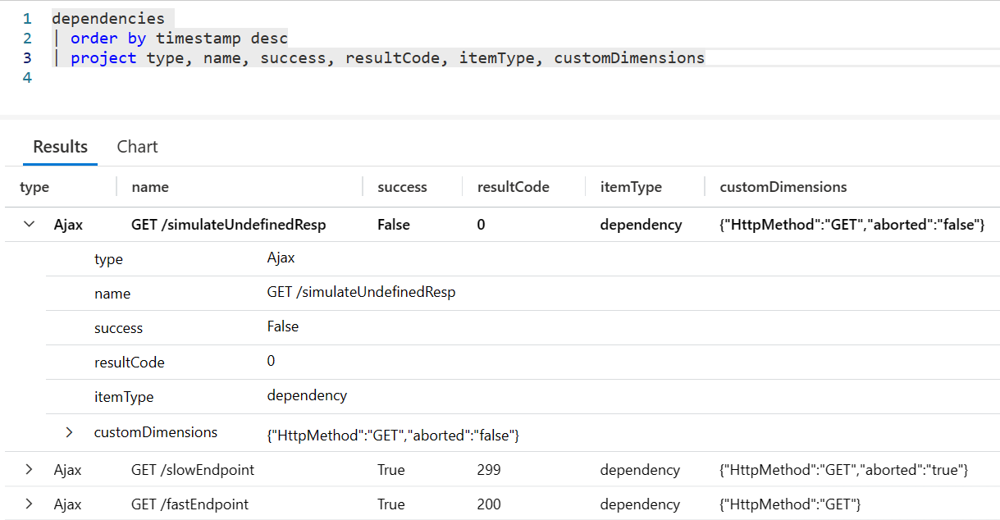

# Make Application Insights even more insightful with telemetry enrichment
Application Insights offers a tremendous amount of observability with minimal configuration. The library of SDKs and collection agents truly do a wonderful job straight out of the box. However, they cannot account for every possible scenario. Some times we need more context-specific information for an essential insight. This is where telemetry enrichment comes into play. In this article we will explore a real world scenario where we used telemetry enrichment to provide that crucial insight.

Let me provide some context before we get started. The application is a single page web app supported by a BFF, both of which are instrumented with the Application Insights SDK for their respective platform. Application Insights has built-in dashboards that provide various perspectives of the health of our app. One of those dashboards is the failures dashboard. The failures dashboard is organized around two major perspectives, server side telemetry and client side telemetry.

## Here's our dilemma
The server side telemetry is painting a mostly unremarkable picture, there are some exceptions but nothing is setting off red flags. The client side is a different story. A very large number of request are shown as failures with a result* code of 0 (zero). Wait a tick... result code 0? We were expecting to see HTTP 400 and 500 codes. What does result code 0 mean?

> \* In Application Insights you will see a field called Re**sult** Code instead of Res**ponse** Code. Application Insights tracks more than just HTTP dependencies so you may see non-HTTP codes in the logs if your application has other types of dependencies. In our case we were dealing with HTTP traffic so a code of 0 was not something we were expecting.

## Result code 0
Most of us are familiar with the common HTTP response status codes. 200 OK, 301 Redirect, 404 Not-Found, etc... but have you encountered response code 0 (zero). In case you haven't, let me explain what it's all about.

When we think of response status codes we presuppose that the HTTP round trip completed in it's entirety. In other words, we take it for granted that the server received the request from the client and subsequently the response from the server made it back to the client. But what happens when the client doesn't hear back from the server in a timely fashion, or perhaps the client aborts a request that is no longer needed? We'll refer to these scenarios as 'fragmented pair' scenarios.



### Fragmented Pair - Undefined response and aborted requests
The fragmented pair scenarios can be grouped into two broad categories. The first category encompasses circumstances like network partition, back-end service disruption, a busy server, the intern tripped over the power cable, etc... In these circumstances the client has no way of knowing if the server was able to send a response, and if so, did the response get lost on the way to the client. In other words, the client can't tell the difference between the server crashing (no response was ever generated) and the server responding with an HTTP 200 Success that was lost due to network connectivity issues. From the client's perspective the response is **undefined**.

There is little the client telemetry agent can do when the response is undefined. For the sake of argument let's assume the server was able to respond but the response never arrived at the client due to a network partition. Ostensibly Application Insights could correlate the client's request with the server response **after the fact** because ultimately Application Insights has visibility into both sides. Even so, we must consider the response undefined because the response never reached the client. At the time of the request the client was left holding the bag. The client telemetry agent is forced to record the request as a failure and assign a result code of 0 as a way to signal that the response was undefined.

The second category of fragmented pairs encompasses circumstances where the client code deliberately aborts a request. This category includes things like the user cancelling a request that is taking longer than normal. Another likely example would be the client code cancelling an in-progress autocomplete search query because the user entered a few more characters thus making the in-progress query no longer relevant.

As you may have surmise, there is a key difference between the first and second category of fragmented pairs. In the second category the client knows why it aborted the request. This key detail will be important as we work towards a solution.

## Back to the dilemma 

To recap, the server side telemetry is showing nothing out of the ordinary but the client side telemetry is showing a large number of failed request with a result code of 0. After drilling into the logs we discover that the vast majority of client side exceptions are attributed to an autocomplete search. Our intuition is telling us that perhaps these failed request are being deliberately aborted by the client. A quick glance at the client code confirms that the client is in fact aborting autocomplete queries when they are no longer necessary. Because we know the client is aborting request we can safely assume that some percentage of the reportedly failed request are false positives (aborted request).

Here is the catch, the client telemetry agent can't tell the difference between an aborted request and an undefined response. The client telemetry agent simply doesn't understand the context of the request, how could it? So it does the only sensible thing, it records aborted request and undefined responses the same way, as dependency failures with a result code of 0. 

What this means for us is that we can't rule out that the client is not experiencing undefined responses based solely on the telemetry logs because the logs do not provide enough information to discern between aborted request and undefined responses.

> ## Solution summary
> Enrich the telemetry logs with the "aborted" property of the XMLHttpRequest (XHR) object in order to discern between aborted request and undefined responses. Optionally set a custom result code as part of the enrichment to further differentiate aborted request from unexpected exceptions.

> ## Update
> The Application Insights javascript SDK will soon start including the abort property from the XMLHttpRequest API as part of it's default data collection. You may still find the information in this article valuable if you are using the fetch API, you want to use custom response codes, or you want to include other custom dimensions.

## The solution
In order to discern between deliberately aborted requests and undefined responses we will need to enrich the telemetry logs with enough information to tell them apart. The solution comes in two parts: what information do we add to the telemetry logs and how exactly do we ago about adding said information to the telemetry logs.  

As for the 'what', we got that covered. The XHR (XMLHttpRequest) object exposes an aptly named attributed called [aborted](https://www.w3.org/TR/XMLHttpRequest1/#dom-xmlhttprequest-send). The fetch api does not expose an aborted attribute directly but equivalent functionality is provided by the [AbortControl](https://developer.mozilla.org/en-US/docs/Web/API/AbortController) interface.

As for the 'how', it is Application Insights to the rescue. In Application Insights parlance, the XHR and fetch request are referred to as dependencies. The Application Insights javascript SDK provides callback functions that are called before and after a dependency is utilized. There are also callbacks available that are called before the telemetry record is sent to the collection point. To learn more about these callbacks visit [ApplicationInsights-JS](https://github.com/microsoft/ApplicationInsights-JS). The callbacks expose the necessary data and functionality to accomplish our goal.

### The code

> For the sake of brevity I am going to assume your app is already configured with Applications Insights. If not, don't worry, it's easy. Here is the [guide](https://learn.microsoft.com/en-us/azure/azure-monitor/app/javascript?tabs=snippet#add-the-javascript-sdk).

In this solution we will implement the following callbacks:
* **Dependency Listener**
* **Dependency Initializer**
* **Telemetry Initializer**

Each callback function builds on the previous callback to form a complete solution. Next we'll dive into the details of each callback function, then put it all together at the end.

#### Dependency Listener
The [Dependency Listener](https://github.com/microsoft/ApplicationInsights-JS#dependency-listeners) callback function is called before the dependency is called from the browser. It provides the following:

> * Complete access to either the XMLHttpRequest instance or the fetch API input and init arguments.
> * Ability to get/set the properties used to generate the W3C traceparent header (traceId, spanId, traceFlags)
> * Set values in the object context container for other listeners called after the current one, as well as this context object is also made available to all dependency initializers.

The first and third bullet above are what we need for our solution. Access to the XHR instance and the init argument of the fetch api means we can inspect those objects to determine if the request was aborted. The capabilities offered by the third bullet allows us to bubble the information we need to the dependency initializers and eventually the telemetry initializer.

```javascript
sdk.addDependencyListener((dependencyDetails) => {
	//add a custom function to the dependency context that we can interrogate after the dependency is completed.
	dependencyDetails.context.isAborted = () =>
		if(dependencyDetails.xhr !== undefined){
			return (dependencyDetails.xhr.ajaxData.aborted == 1);
		}
		if(dependencyDetails.init !== undefined){
			return dependencyDetails.init.signal?.aborted;
		}
		return false;
	};
});
```

Things to note about this sample code:
* The aborted property on the xhr.ajaxData object is an integer where as on the init.signal object it is a boolean. I am choosing to normalize the return value of the function as a boolean.
* The logic to discern between an XHR and a fetch request is encapsulated in a function. This is for three reasons.
  * If we don't do it here we will need to bubble up both XHR and the init to the rest of the callback chain.
  * Plain old code encapsulation. To put it bluntly, the rest of the callback chain doesn't much care how the aborted property is obtained.
  * The actual HTTP request hasn't been made yet so if we were to observe the value of the aborted property the property would be undefined.

#### Dependency Initializer
The [Dependency Initializer](https://github.com/microsoft/ApplicationInsights-JS#dependency-initializers) callback is called after the dependency is called from the browser but before the telemetry record is packaged and sent to Application Insights. This callback provides a lot of functionality but for our purposes all we need is to bubble up our custom 'isAborted' function to the telemetry initializer.

```javascript
sdk.addDependencyInitializer((dependencyDetails) => {
	//bubble up the isAborted function from the dependency callbacks to the telemetry callbacks. Here the item property represents the baseData property of the telemetry envelope (see the Telemetry Initializer)
	//so we pass bubble up our custom function so we can execute the function during addTelemetryInitializer.
	dependencyDetails.item.isAborted = dependencyDetails.context.isAborted;
});
```

#### Telemetry Initializer
The [Telemetry Initializer](https://github.com/microsoft/ApplicationInsights-JS#telemetry-initializers) callback function is called before the telemetry data is sent to the Application Insights collection endpoint. This is our last chance to enrich the telemetry data. The envelope argument exposes a property called data. This property is where we can stash any custom information that we want collected by Application Insights.

```javascript
sdk.addTelemetryInitializer((envelope) => {
	if(envelope.baseData.responseCode == 0 && typeof envelope.baseData.isAborted === 'function'){
		//enrich the telemetry data with the aborted property
		envelope.data.aborted = envelope.baseData.isAborted();
		//optionally add your own custom response code to easily distinguish between request aborted by the client and other reasons for why the request failed.
		if(envelope.data.aborted){
			envelope.baseData.responseCode = 299; //299 is an arbitrary response code. Feel free to chose a response code that better suits your needs.
			envelope.baseData.success = true;
		}
	}
});
```

Things to note about this sample code:
* We are only capturing the aborted property if the response code equals 0. This is simply an optimization so we don't call our custom isAborted function unnecessarily and we don't capture more data than we need.
* I chose to replace the response code with a custom response code. The reason for replacing the response code is purely pragmatic. If we leave the response code as 0 the observability platform will consider these request as failed. Using a custom response code avoids that pesky issue and it also servers as a hint for folks unfamiliar with the application that there is a custom solution of some kind in the application.

#### Putting it all together
Our work here is done. The Application Insights SDK will call the callbacks and take care of pushing the enriched telemetry record to the collection endpoint. The dashboard on the Application Insights portal no longer show aborted request as failed dependencies and we can discern between aborted request and undefined responses.

### Free Samples
As part of this article I've included some sample code, although I'm pretty sure the internet would break if I didn't include some code samples. The sample code is designed to illustrate three key scenarios I encourage you to check them out to see what telemetry enrichment can do for you. The three scenarios are implemented using both the XMLHttpRequest and fetch APIs, for a grand total of 6 samples. 

The sample code assumes you've already provision an Application Insights instance. You will need to provide your own connection string. Take a look at the index.html page where you will find a spot to provide your connection string and a simple user interface for the samples.

#### 1. Successful request

We'll start out with a simple successful request that does not require enrichment. I included this scenario for two reasons. First, as a sanity check that validates we've wired everything together properly. Second, to give us a point of reference for comparing successful request against aborted and undefined responses when reviewing the Application Insights dashboards.



#### 2. Aborted request
The aborted request scenario is where you will realize the benefits of this solution. When the telemetry record is enriched the you will find a property named aborted under the customDimensions field of the dependencies table in the Azure Monitor Logs. If you chose to set a custom HTTP response code you will also see it reflected in the dependency table under the resultCode field. Note that the field on the table is called re**sult**Code and not res**ponse**Code as mentioned earlier.



#### 3. Undefined response
Our last scenario is an undefined response. To simulate this scenario we will cause the server to abort the TCP connection. We typically don't want to abort a TCP connection on the server but it's a reliable way to induce an undefined response for the purposes of this demo. In this case the client has no idea why it didn't receive a response. All the client can do here is enrich the telemetry record by setting the aborted property to false and keeping the result code as 0. The combination of tye aborted property being set to false and a result code of 0 signals to the monitoring solution that the response failed or was otherwise lost to the ether by no fault of the client. Knowing that the client didn't deliberately abort the request is valuable when troubleshooting exceptions.



## Parting thoughts

Inaccurate telemetry data is wasteful at best and causes apathy at worst. Always ensure your observability solution is providing accurate data and actionable insights. If your observability platform is not providing you with the information you need I encourage you to invest the resources necessary to make it so. 